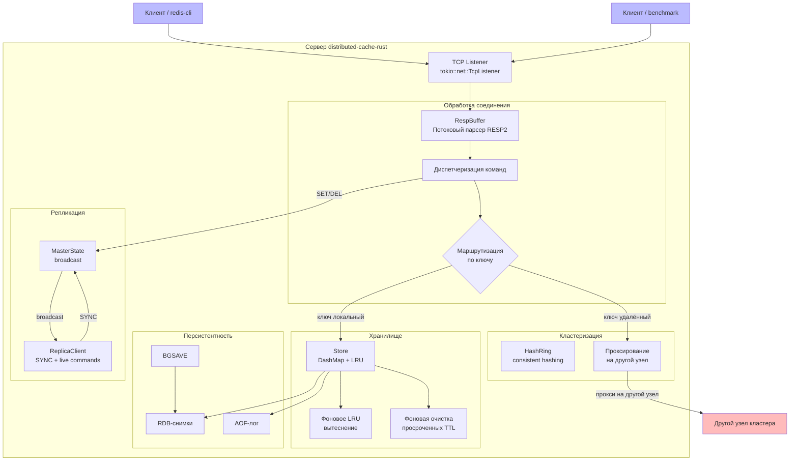
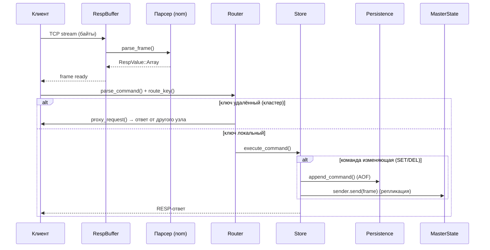

# Архитектура

## Общая схема



## Поток выполнения запроса



## Структура модулей

```
src/
├── main.rs                 # Точка входа, настройка сервера, фоновые задачи
├── cmd.rs                  # Парсинг и выполнение команд (Command enum)
├── store/
│   └── mod.rs              # In-memory хранилище (DashMap + LRU + TTL)
├── persistence/
│   └── mod.rs              # RDB-снимки и AOF-лог
├── cluster/
│   ├── mod.rs              # ClusterState, проксирование
│   └── hashring.rs         # Consistent hashing (HashRing)
├── replication/
│   └── mod.rs              # MasterState, ReplicaClient, ReplicationConfig
├── resp/
│   ├── mod.rs              # Реэкспорт парсера
│   └── parser.rs           # RESP2 парсер (nom) + RespBuffer
└── bin/
    └── benchmark.rs        # Нагрузочный клиент
```

## Используемые технологии

| Компонент | Технология |
|---|---|
| Асинхронный I/O | Tokio (tokio::net, tokio::io, tokio::spawn) |
| In-memory хранилище | DashMap (concurrent HashMap) |
| Парсинг RESP2 | nom 8 (streaming-парсер) |
| Кластеризация | SHA-256 (через крейт sha2) |
| Логирование | tracing + tracing-subscriber |
| Сериализация JSON | serde + serde_json |
| Случайные числа | rand 0.9 |
| Контейнеризация | Docker (многоэтапная сборка, debian:bookworm-slim) |

## Ключевые архитектурные решения

1. **Асинхронная модель Tokio** — каждое соединение обрабатывается в отдельной задаче
   `tokio::spawn`, планировщик Tokio распределяет нагрузку между ядрами CPU.

2. **Приближённый LRU** — вместо точного LRU (дорогого в concurrent среде) используется
   случайная выборка из 5 ключей, из которых удаляется самый старый. Это даёт
   производительность, близкую к оптимальной, с константной сложностью.

3. **RESP2-формат для RDB** — снимки хранятся как последовательность RESP2-команд SET,
   что позволяет использовать тот же парсер для загрузки (избегая дублирования логики).

4. **Consistent hashing с 256 vnodes** — равномерное распределение ключей (разброс < 10%)
   без централизованного координатора.

5. **Broadcast-репликация** — мастер транслирует изменяющие команды всем репликам
   через `tokio::sync::broadcast`. Реплики применяют команды в том же порядке.
